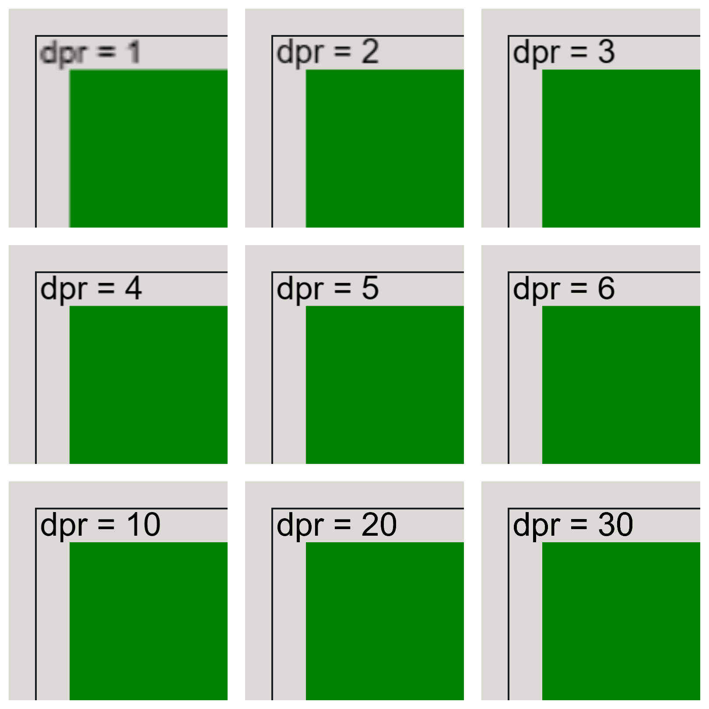
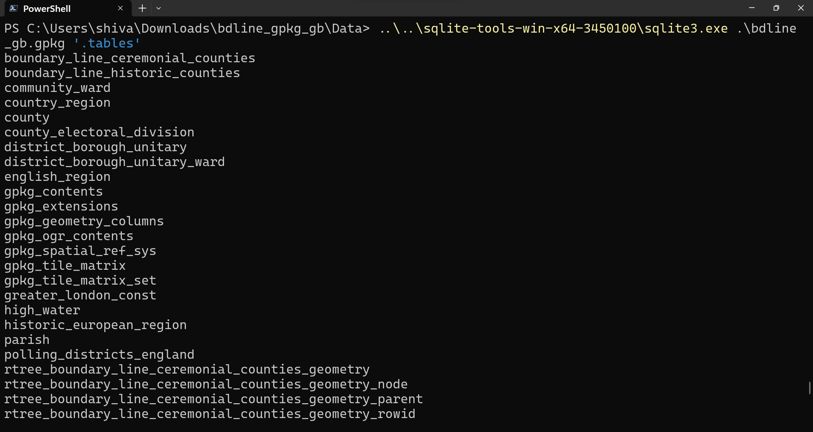

# TfL Bus Mapping v2 - using canvas

## Motivation
I've previously made a version of the TfL bus routes in London using svg elements, but even while compelting that project, I felt that the loading time was poor. Having become wiser in the ways of canvas, I now realise that svg quickly becomes unsuitable for a large number of elements drawn onto the screen and canvas is a more suitable option.

## Aim
To create a bus route on a map using canvas, with interactive elements.

## Details

### Overview
The overall steps are to first plot a basemap showing London divided into boroughs. On top of this, the bus routes need to be drawn. Then, interactivity needs to be added, whereby hovering over a certain bus route displays data about it.

#### Slow loading times
<!-- pic of times (from chrome dev tools) spent downloading and redering js and svgs, to show how loading time is slow and needs to be improved -->

### Displaying London basemap
Just like I first did when creating v1 of the map, I need to plot a basemap of London, with borough information.

But before doing this, as I was already aware of poor image quality with canvas, especially when zooming in, I created some code to change the devicePixelRatio (dpr) of the canvas, which in effect means uses a larger canvas size, but then rescaling it using CSS to its original size. This has the effect of making text and edges sharper, as seen in the image below.

Higher dpr does make the page load slower, so I compromised at dpr=4, as the quality of the render does not significantly improve at higher numbers than that.

This time, I wanted to get the borough data from official sources. Therefore, I researched and ended up installing the latest data from [Ordnance Survey OpenData](https://osdatahub.os.uk/downloads/open/BoundaryLine) in a GeoPackage format. This file is a whopping 1.42 GB! So the first thing I needed to do was extract out of this file only the London data I would be using. A bit more research on Google led me to find out that a GeoPackage file is simply an SQLite Database file with a .gpkg extension, so I first queried it using the sqlite3 command line tool.

This image from the official geopackage website shows this entity relation diagram, which shows that the gpkg_contents table contains a list of all the table names. It outputs the following list (`SELECT GROUP_CONCAT(table_name) FROM gpkg_contents;`):
* boundary_line_ceremonial_counties
* boundary_line_historic_counties
* community_ward
* country_region
* county
* county_electoral_division
* district_borough_unitary
* district_borough_unitary_ward
* english_region
* greater_london_const
* high_water
* historic_european_region
* parish
* polling_districts_england
* scotland_and_wales_const
* scotland_and_wales_region
* unitary_electoral_division
* westminster_const

A bit of trial-and-error of selecting the first line from each table led to finding out that this command gave a list of all the London boroughs: `SELECT * FROM district_borough_unitary WHERE Area_Description = 'London Borough' AND File_Name = 'GREATER_LONDON_AUTHORITY';`. The output of that command was the table below:
<table>
    <caption>
        Output of district_borough_unitary table with WHERE filters.
    </caption>
    <thead>
        <tr>
            <th scope="col">fid</th>
            <th scope="col">geometry</th>
            <th scope="col">Name</th>
            <th scope="col">Area_Code</th>
            <th scope="col">Area_Description</th>
            <th scope="col">File_Name</th>
            <th scope="col">Feature_Serial_Number</th>
            <th scope="col">Collection_Serial_Number</th>
            <th scope="col">Global_Polygon_ID</th>
            <th scope="col">Admin_Unit_ID</th>
            <th scope="col">Census_Code</th>
            <th scope="col">Hectares</th>
            <th scope="col">Non_Inland_Area</th>
            <th scope="col">Area_Type_Code</th>
            <th scope="col">Area_Type_Description</th>
            <th scope="col">Non_Area_Type_Code</th>
            <th scope="col">Non_Area_Type_Description</th>
        </tr>
    </thead>
    <tbody>
        <tr>
            <td>221</td>
            <td>GP</td>
            <td>Hounslow London Boro</td>
            <td>LBO</td>
            <td>London Borough</td>
            <td>GREATER_LONDON_AUTHORITY</td>
            <td>221</td>
            <td>221</td>
            <td>51138</td>
            <td>11489</td>
            <td>E09000018</td>
            <td>5658.903</td>
            <td>62.691</td>
            <td>AA</td>
            <td>CIVIL ADMINISTRATION AREA</td>
            <td></td>
            <td></td>
        </tr>
        <tr>
            <td>222</td>
            <td>GP</td>
            <td>Ealing London Boro</td>
            <td>LBO</td>
            <td>London Borough</td>
            <td>GREATER_LONDON_AUTHORITY</td>
            <td>222</td>
            <td>222</td>
            <td>50523</td>
            <td>11399</td>
            <td>E09000009</td>
            <td>5554.207</td>
            <td>0.0</td>
            <td>AA</td>
            <td>CIVIL ADMINISTRATION AREA</td>
            <td></td>
            <td></td>
        </tr>
        <tr>
            <td>223</td>
            <td>GP</td>
            <td>Havering London Boro</td>
            <td>LBO</td>
            <td>London Borough</td>
            <td>GREATER_LONDON_AUTHORITY</td>
            <td>223</td>
            <td>223</td>
            <td>50851</td>
            <td>10807</td>
            <td>E09000016</td>
            <td>11444.927</td>
            <td>211.338</td>
            <td>AA</td>
            <td>CIVIL ADMINISTRATION AREA</td>
            <td></td>
            <td></td>
        </tr>
        <tr>
            <td>224</td>
            <td>GP</td>
            <td>Hillingdon London Boro</td>
            <td>LBO</td>
            <td>London Borough</td>
            <td>GREATER_LONDON_AUTHORITY</td>
            <td>224</td>
            <td>224</td>
            <td>51011</td>
            <td>11539</td>
            <td>E09000017</td>
            <td>11570.741</td>
            <td>0.0</td>
            <td>AA</td>
            <td>CIVIL ADMINISTRATION AREA</td>
            <td></td>
            <td></td>
        </tr>
        <tr>
            <td>225</td>
            <td>GP</td>
            <td>Harrow London Boro</td>
            <td>LBO</td>
            <td>London Borough</td>
            <td>GREATER_LONDON_AUTHORITY</td>
            <td>225</td>
            <td>225</td>
            <td>50515</td>
            <td>11391</td>
            <td>E09000015</td>
            <td>5046.427</td>
            <td>0.0</td>
            <td>AA</td>
            <td>CIVIL ADMINISTRATION AREA</td>
            <td></td>
            <td></td>
        </tr>
        <tr>
            <td>226</td>
            <td>GP</td>
            <td>Brent London Boro</td>
            <td>LBO</td>
            <td>London Borough</td>
            <td>GREATER_LONDON_AUTHORITY</td>
            <td>226</td>
            <td>226</td>
            <td>50485</td>
            <td>11447</td>
            <td>E09000005</td>
            <td>4323.637</td>
            <td>0.0</td>
            <td>AA</td>
            <td>CIVIL ADMINISTRATION AREA</td>
            <td></td>
            <td></td>
        </tr>
        <tr>
            <td>227</td>
            <td>GP</td>
            <td>Barnet London Boro</td>
            <td>LBO</td>
            <td>London Borough</td>
            <td>GREATER_LONDON_AUTHORITY</td>
            <td>227</td>
            <td>227</td>
            <td>119320</td>
            <td>11378</td>
            <td>E09000003</td>
            <td>8676.67</td>
            <td>0.0</td>
            <td>AA</td>
            <td>CIVIL ADMINISTRATION AREA</td>
            <td></td>
            <td></td>
        </tr>
        <tr>
            <td>228</td>
            <td>GP</td>
            <td>Lambeth London Boro</td>
            <td>LBO</td>
            <td>London Borough</td>
            <td>GREATER_LONDON_AUTHORITY</td>
            <td>228</td>
            <td>228</td>
            <td>50792</td>
            <td>11144</td>
            <td>E09000022</td>
            <td>2723.759</td>
            <td>43.058</td>
            <td>AA</td>
            <td>CIVIL ADMINISTRATION AREA</td>
            <td></td>
            <td></td>
        </tr>
        <tr>
            <td>229</td>
            <td>GP</td>
            <td>Southwark London Boro</td>
            <td>LBO</td>
            <td>London Borough</td>
            <td>GREATER_LONDON_AUTHORITY</td>
            <td>229</td>
            <td>229</td>
            <td>51271</td>
            <td>11013</td>
            <td>E09000028</td>
            <td>2992.309</td>
            <td>104.539</td>
            <td>AA</td>
            <td>CIVIL ADMINISTRATION AREA</td>
            <td></td>
            <td></td>
        </tr>
        <tr>
            <td>230</td>
            <td>GP</td>
            <td>Lewisham London Boro</td>
            <td>LBO</td>
            <td>London Borough</td>
            <td>GREATER_LONDON_AUTHORITY</td>
            <td>230</td>
            <td>230</td>
            <td>51209</td>
            <td>11039</td>
            <td>E09000023</td>
            <td>3531.398</td>
            <td>16.786</td>
            <td>AA</td>
            <td>CIVIL ADMINISTRATION AREA</td>
            <td></td>
            <td></td>
        </tr>
        <tr>
            <td>231</td>
            <td>GP</td>
            <td>Greenwich London Boro</td>
            <td>LBO</td>
            <td>London Borough</td>
            <td>GREATER_LONDON_AUTHORITY</td>
            <td>231</td>
            <td>231</td>
            <td>50909</td>
            <td>10777</td>
            <td>E09000011</td>
            <td>5044.693</td>
            <td>313.569</td>
            <td>AA</td>
            <td>CIVIL ADMINISTRATION AREA</td>
            <td></td>
            <td></td>
        </tr>
        <tr>
            <td>232</td>
            <td>GP</td>
            <td>Bexley London Boro</td>
            <td>LBO</td>
            <td>London Borough</td>
            <td>GREATER_LONDON_AUTHORITY</td>
            <td>232</td>
            <td>232</td>
            <td>50891</td>
            <td>10759</td>
            <td>E09000004</td>
            <td>6430.953</td>
            <td>373.731</td>
            <td>AA</td>
            <td>CIVIL ADMINISTRATION AREA</td>
            <td></td>
            <td></td>
        </tr>
        <tr>
            <td>233</td>
            <td>GP</td>
            <td>Enfield London Boro</td>
            <td>LBO</td>
            <td>London Borough</td>
            <td>GREATER_LONDON_AUTHORITY</td>
            <td>233</td>
            <td>233</td>
            <td>50541</td>
            <td>11329</td>
            <td>E09000010</td>
            <td>8216.974</td>
            <td>0.0</td>
            <td>AA</td>
            <td>CIVIL ADMINISTRATION AREA</td>
            <td></td>
            <td></td>
        </tr>
        <tr>
            <td>234</td>
            <td>GP</td>
            <td>Waltham Forest London Boro</td>
            <td>LBO</td>
            <td>London Borough</td>
            <td>GREATER_LONDON_AUTHORITY</td>
            <td>234</td>
            <td>234</td>
            <td>50687</td>
            <td>11213</td>
            <td>E09000031</td>
            <td>3881.023</td>
            <td>0.0</td>
            <td>AA</td>
            <td>CIVIL ADMINISTRATION AREA</td>
            <td></td>
            <td></td>
        </tr>
        <tr>
            <td>235</td>
            <td>GP</td>
            <td>Redbridge London Boro</td>
            <td>LBO</td>
            <td>London Borough</td>
            <td>GREATER_LONDON_AUTHORITY</td>
            <td>235</td>
            <td>235</td>
            <td>51301</td>
            <td>10955</td>
            <td>E09000026</td>
            <td>5643.101</td>
            <td>3.687</td>
            <td>AA</td>
            <td>CIVIL ADMINISTRATION AREA</td>
            <td></td>
            <td></td>
        </tr>
        <tr>
            <td>236</td>
            <td>GP</td>
            <td>Wandsworth London Boro</td>
            <td>LBO</td>
            <td>London Borough</td>
            <td>GREATER_LONDON_AUTHORITY</td>
            <td>236</td>
            <td>236</td>
            <td>122400</td>
            <td>11127</td>
            <td>E09000032</td>
            <td>3521.603</td>
            <td>95.416</td>
            <td>AA</td>
            <td>CIVIL ADMINISTRATION AREA</td>
            <td></td>
            <td></td>
        </tr>
        <tr>
            <td>237</td>
            <td>GP</td>
            <td>Hammersmith and Fulham London Boro</td>
            <td>LBO</td>
            <td>London Borough</td>
            <td>GREATER_LONDON_AUTHORITY</td>
            <td>237</td>
            <td>237</td>
            <td>50647</td>
            <td>11259</td>
            <td>E09000013</td>
            <td>1715.759</td>
            <td>75.622</td>
            <td>AA</td>
            <td>CIVIL ADMINISTRATION AREA</td>
            <td></td>
            <td></td>
        </tr>
        <tr>
            <td>238</td>
            <td>GP</td>
            <td>Kensington and Chelsea London Boro</td>
            <td>LBO</td>
            <td>London Borough</td>
            <td>GREATER_LONDON_AUTHORITY</td>
            <td>238</td>
            <td>238</td>
            <td>50658</td>
            <td>11270</td>
            <td>E09000020</td>
            <td>1238.595</td>
            <td>26.027</td>
            <td>AA</td>
            <td>CIVIL ADMINISTRATION AREA</td>
            <td></td>
            <td></td>
        </tr>
        <tr>
            <td>239</td>
            <td>GP</td>
            <td>City of Westminster London Boro</td>
            <td>LBO</td>
            <td>London Borough</td>
            <td>GREATER_LONDON_AUTHORITY</td>
            <td>239</td>
            <td>239</td>
            <td>50724</td>
            <td>11164</td>
            <td>E09000033</td>
            <td>2203.779</td>
            <td>55.517</td>
            <td>AA</td>
            <td>CIVIL ADMINISTRATION AREA</td>
            <td></td>
            <td></td>
        </tr>
        <tr>
            <td>240</td>
            <td>GP</td>
            <td>Camden London Boro</td>
            <td>LBO</td>
            <td>London Borough</td>
            <td>GREATER_LONDON_AUTHORITY</td>
            <td>240</td>
            <td>240</td>
            <td>50632</td>
            <td>11244</td>
            <td>E09000007</td>
            <td>2177.858</td>
            <td>0.0</td>
            <td>AA</td>
            <td>CIVIL ADMINISTRATION AREA</td>
            <td></td>
            <td></td>
        </tr>
        <tr>
            <td>241</td>
            <td>GP</td>
            <td>Tower Hamlets London Boro</td>
            <td>LBO</td>
            <td>London Borough</td>
            <td>GREATER_LONDON_AUTHORITY</td>
            <td>241</td>
            <td>241</td>
            <td>50746</td>
            <td>11185</td>
            <td>E09000030</td>
            <td>2157.691</td>
            <td>180.604</td>
            <td>AA</td>
            <td>CIVIL ADMINISTRATION AREA</td>
            <td></td>
            <td></td>
        </tr>
        <tr>
            <td>242</td>
            <td>GP</td>
            <td>Islington London Boro</td>
            <td>LBO</td>
            <td>London Borough</td>
            <td>GREATER_LONDON_AUTHORITY</td>
            <td>242</td>
            <td>242</td>
            <td>50581</td>
            <td>11281</td>
            <td>E09000019</td>
            <td>1485.804</td>
            <td>0.0</td>
            <td>AA</td>
            <td>CIVIL ADMINISTRATION AREA</td>
            <td></td>
            <td></td>
        </tr>
        <tr>
            <td>243</td>
            <td>GP</td>
            <td>Hackney London Boro</td>
            <td>LBO</td>
            <td>London Borough</td>
            <td>GREATER_LONDON_AUTHORITY</td>
            <td>243</td>
            <td>243</td>
            <td>50673</td>
            <td>11199</td>
            <td>E09000012</td>
            <td>1904.388</td>
            <td>0.0</td>
            <td>AA</td>
            <td>CIVIL ADMINISTRATION AREA</td>
            <td></td>
            <td></td>
        </tr>
        <tr>
            <td>244</td>
            <td>GP</td>
            <td>Haringey London Boro</td>
            <td>LBO</td>
            <td>London Borough</td>
            <td>GREATER_LONDON_AUTHORITY</td>
            <td>244</td>
            <td>244</td>
            <td>119322</td>
            <td>11290</td>
            <td>E09000014</td>
            <td>2960.619</td>
            <td>0.0</td>
            <td>AA</td>
            <td>CIVIL ADMINISTRATION AREA</td>
            <td></td>
            <td></td>
        </tr>
        <tr>
            <td>245</td>
            <td>GP</td>
            <td>Newham London Boro</td>
            <td>LBO</td>
            <td>London Borough</td>
            <td>GREATER_LONDON_AUTHORITY</td>
            <td>245</td>
            <td>245</td>
            <td>51363</td>
            <td>10929</td>
            <td>E09000025</td>
            <td>3857.582</td>
            <td>237.992</td>
            <td>AA</td>
            <td>CIVIL ADMINISTRATION AREA</td>
            <td></td>
            <td></td>
        </tr>
        <tr>
            <td>246</td>
            <td>GP</td>
            <td>Barking and Dagenham London Boro</td>
            <td>LBO</td>
            <td>London Borough</td>
            <td>GREATER_LONDON_AUTHORITY</td>
            <td>246</td>
            <td>246</td>
            <td>51295</td>
            <td>10949</td>
            <td>E09000002</td>
            <td>3778.184</td>
            <td>168.045</td>
            <td>AA</td>
            <td>CIVIL ADMINISTRATION AREA</td>
            <td></td>
            <td></td>
        </tr>
        <tr>
            <td>247</td>
            <td>GP</td>
            <td>City and County of the City of London</td>
            <td>LBO</td>
            <td>London Borough</td>
            <td>GREATER_LONDON_AUTHORITY</td>
            <td>247</td>
            <td>247</td>
            <td>51187</td>
            <td>11105</td>
            <td>E09000001</td>
            <td>314.688</td>
            <td>25.72</td>
            <td>AA</td>
            <td>CIVIL ADMINISTRATION AREA</td>
            <td></td>
            <td></td>
        </tr>
        <tr>
            <td>322</td>
            <td>GP</td>
            <td>Kingston upon Thames London Boro</td>
            <td>LBO</td>
            <td>London Borough</td>
            <td>GREATER_LONDON_AUTHORITY</td>
            <td>322</td>
            <td>322</td>
            <td>50448</td>
            <td>11412</td>
            <td>E09000021</td>
            <td>3725.556</td>
            <td>0.0</td>
            <td>AA</td>
            <td>CIVIL ADMINISTRATION AREA</td>
            <td></td>
            <td></td>
        </tr>
        <tr>
            <td>323</td>
            <td>GP</td>
            <td>Croydon London Boro</td>
            <td>LBO</td>
            <td>London Borough</td>
            <td>GREATER_LONDON_AUTHORITY</td>
            <td>323</td>
            <td>323</td>
            <td>51330</td>
            <td>10896</td>
            <td>E09000008</td>
            <td>8646.611</td>
            <td>0.0</td>
            <td>AA</td>
            <td>CIVIL ADMINISTRATION AREA</td>
            <td></td>
            <td></td>
        </tr>
        <tr>
            <td>324</td>
            <td>GP</td>
            <td>Bromley London Boro</td>
            <td>LBO</td>
            <td>London Borough</td>
            <td>GREATER_LONDON_AUTHORITY</td>
            <td>324</td>
            <td>324</td>
            <td>50904</td>
            <td>10772</td>
            <td>E09000006</td>
            <td>15012.875</td>
            <td>0.0</td>
            <td>AA</td>
            <td>CIVIL ADMINISTRATION AREA</td>
            <td></td>
            <td></td>
        </tr>
        <tr>
            <td>343</td>
            <td>GP</td>
            <td>Richmond upon Thames London Boro</td>
            <td>LBO</td>
            <td>London Borough</td>
            <td>GREATER_LONDON_AUTHORITY</td>
            <td>343</td>
            <td>343</td>
            <td>50463</td>
            <td>11427</td>
            <td>E09000027</td>
            <td>5874.115</td>
            <td>135.373</td>
            <td>AA</td>
            <td>CIVIL ADMINISTRATION AREA</td>
            <td></td>
            <td></td>
        </tr>
        <tr>
            <td>344</td>
            <td>GP</td>
            <td>Merton London Boro</td>
            <td>LBO</td>
            <td>London Borough</td>
            <td>GREATER_LONDON_AUTHORITY</td>
            <td>344</td>
            <td>344</td>
            <td>122401</td>
            <td>10995</td>
            <td>E09000024</td>
            <td>3762.404</td>
            <td>0.0</td>
            <td>AA</td>
            <td>CIVIL ADMINISTRATION AREA</td>
            <td></td>
            <td></td>
        </tr>
        <tr>
            <td>350</td>
            <td>GP</td>
            <td>Sutton London Boro</td>
            <td>LBO</td>
            <td>London Borough</td>
            <td>GREATER_LONDON_AUTHORITY</td>
            <td>350</td>
            <td>350</td>
            <td>50829</td>
            <td>10873</td>
            <td>E09000029</td>
            <td>4384.662</td>
            <td>0.0</td>
            <td>AA</td>
            <td>CIVIL ADMINISTRATION AREA</td>
            <td></td>
            <td></td>
        </tr>
    </tbody>
</table>

The table had the following metadata:
data_type = features
last_change = 2023-09-18T14:45:54.343Z
min_x = 5512.9985
min_y = 5333.81
max_x = 655992.75
max_y = 1220309.8808
srs_id = 27700

The min and max x and y values will come in useful later when trying to centre the map.

Now that I know what table we need, I can first reduce the file size, so any processing later on uses less resources (though the sqlite command line tool was lightning fast and seemed to have no difficult whatsoever looking through the massive 1.42GB file).

First, I looked at which tables took up most space, to get quick wins. Using the sqlite3_analyzer.exe command line tool that sqlite also provides, I found out that:
* the database consists of 99 tables
* the list of tables given above make up together 99.51% of the file size - though they just contain the label names. The R-tree tables for each of those tables, containing the actual data of the boundaries, interestingly only takes up the remaining 0.49%

Here's a sample of the output:
<table>
    <caption>
        Percentage usage of total database size for tables in database, ordered descending in proportion.
    </caption>
    <thead>
        <tr>
            <th scope="col">Table name</th>
            <th scope="col">Percentage of total database</th>
        </tr>
    </thead>
    <tbody>
        <tr>
            <td>PARISH</td>
            <td>20.70%</td>
        </tr>
        <tr>
            <td>POLLING_DISTRICTS_ENGLAND</td>
            <td>16.60%</td>
        </tr>
        <tr>
            <td>DISTRICT_BOROUGH_UNITARY_WARD</td>
            <td>12.90%</td>
        </tr>
        <tr>
            <td>HIGH_WATER</td>
            <td>9.50%</td>
        </tr>
        <tr>
            <td>WESTMINSTER_CONST</td>
            <td>6.50%</td>
        </tr>
        <tr>
            <td>DISTRICT_BOROUGH_UNITARY</td>
            <td>5.30%</td>
        </tr>
        <tr>
            <td>COUNTY_ELECTORAL_DIVISION</td>
            <td>4.10%</td>
        </tr>
        <tr>
            <td>BOUNDARY_LINE_CEREMONIAL_COUNTIES</td>
            <td>3.30%</td>
        </tr>
        <tr>
            <td>BOUNDARY_LINE_HISTORIC_COUNTIES</td>
            <td>3.30%</td>
        </tr>
        <tr>
            <td>UNITARY_ELECTORAL_DIVISION</td>
            <td>3.30%</td>
        </tr>
        <tr>
            <td>HISTORIC_EUROPEAN_REGION</td>
            <td>2.70%</td>
        </tr>
        <tr>
            <td>SCOTLAND_AND_WALES_CONST</td>
            <td>2.60%</td>
        </tr>
        <tr>
            <td>COMMUNITY_WARD</td>
            <td>2.40%</td>
        </tr>
        <tr>
            <td>COUNTRY_REGION</td>
            <td>2.40%</td>
        </tr>
        <tr>
            <td>SCOTLAND_AND_WALES_REGION</td>
            <td>2.10%</td>
        </tr>
        <tr>
            <td>COUNTY</td>
            <td>0.86%</td>
        </tr>
        <tr>
            <td>ENGLISH_REGION</td>
            <td>0.84%</td>
        </tr>
        <tr>
            <td>GREATER_LONDON_CONST</td>
            <td>0.11%</td>
        </tr>
        <tr>
            <td>RTREE_HIGH_WATER_GEOMETRY_NODE</td>
            <td>0.09%</td>
        </tr>
        <tr>
            <td>RTREE_POLLING_DISTRICTS_ENGLAND_GEOMETRY_NODE</td>
            <td>0.09%</td>
        </tr>
        <tr>
            <td>RTREE_PARISH_GEOMETRY_NODE</td>
            <td>0.04%</td>
        </tr>
        <tr>
            <td>RTREE_HIGH_WATER_GEOMETRY_ROWID</td>
            <td>0.03%</td>
        </tr>
    </tbody>
</table>

When trying to reduce the file size, I went for the low-hanging fruits first and removed those large tables I was not using at all. With the `DROP` and `VACUUM` commands, I was able to reduce the file size down to 83.5MB (a 41% reduction).

I re-ran the sqlite3_analyzer.exe tool, to see what to target next. The sizes were as follows:
| Table Name | Percentage |
| - | - |
| DISTRICT_BOROUGH_UNITARY | 93.6% |
| RTREE_HIGH_WATER_GEOMETRY_NODE | 1.6% |
| RTREE_POLLING_DISTRICTS_ENGLAND_GEOMETRY_NODE | 1.5% |
| RTREE_PARISH_GEOMETRY_NODE | 0.70% |
| RTREE_HIGH_WATER_GEOMETRY_ROWID | 0.41% |

Since I wasn't going to use all of the DISTRICT_BOROUGH_UNITARY table, I dropped those rows that I was not going to use.

`DELETE FROM DISTRICT_BOROUGH_UNITARY WHERE Area_Description != 'London Borough' AND File_Name != 'GREATER_LONDON_AUTHORITY';`

This changed the ratios of the top 5 down to:
| Table Name | Percentage |
| - | - |
| DISTRICT_BOROUGH_UNITARY | 29.0% |
| RTREE_HIGH_WATER_GEOMETRY_NODE | 18.2% |
| RTREE_POLLING_DISTRICTS_ENGLAND_GEOMETRY_NODE | 16.6% |
| RTREE_PARISH_GEOMETRY_NODE | 7.8% |
| RTREE_HIGH_WATER_GEOMETRY_ROWID | 4.6% |

I thought I might as well go the whole way and remove the rtree tables for those I'm not going to use. This reduced the number of tables in the file down to 12 and the file size by 99.84% from the original! I could probably go further and remove any and all references to the deleted tables in the rows of the remaining tables, but it's diminishing returns, so I stopped here. This left the final file to a more manageable 2.25MB.

<!-- optimise code using OffScreenCanvas & WebWorker -->
<!-- multilayered canvas? -->
<!-- add: tools used heading to all readme files, e.g. Javascript, sqlite here -->
