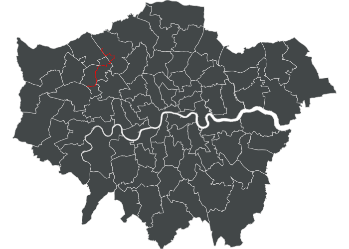
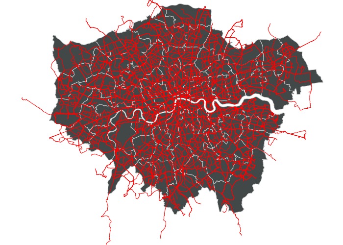
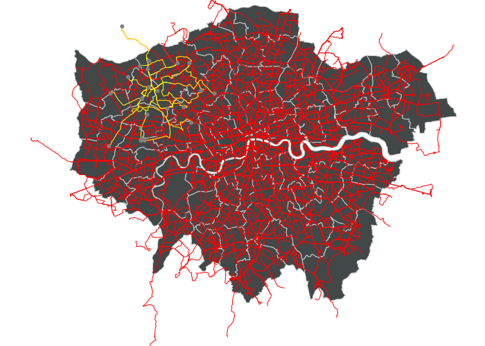
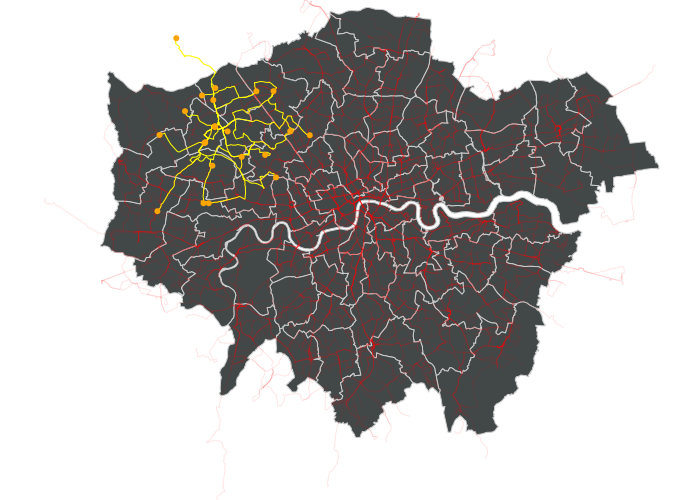
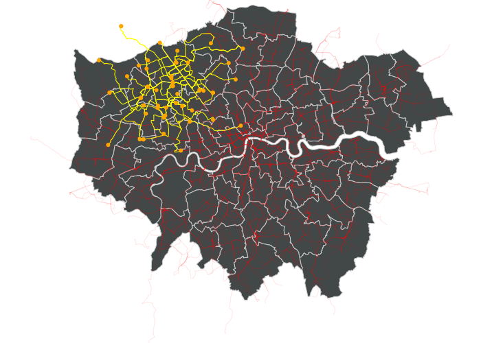

# TfL Bus Mapping

## Motivation
I like to go on walks in the forests/woods surrounding London in the summer when the weather is nice. So, I try to get as far away from my house (and London) by using TfL buses. Thus, I found that it would have been useful to have a map of all the bus routes and what areas they cover to know which area I should explore next. Thus, the idea for this project was born.

## Aim
To create a bus route on a map using D3.js.

## Details

### Overview
The overall process was getting bus route data from the Transport for London (TfL) Unified API. Then, the data had to be converted into a valid GeoJSON object that could be processed by D3.js. Finally, D3.js was used to plot the 10,725 svg elements (just paths and circles) that make up the final image.

### Version-by-version details
For the first version of the map, I simply plotted a map of all London boroughs and added a tooltip using the title tag. The borough data was converted from its original TopoJSON format to a GeoJSON object, for D3.js to understand.

The red line in the image below shows the route for the bus 204.

To get the routes for all buses, I needed to manually query the TfL API for each bus id. First, I got a list of all the valid bus names (there were 678 of them) and then used Node.js to manually query the API and saved all this data together in a very large JSON file, so I didn't have to do this expensive operation again.

This was done using Promise.all and just took me 30s of waiting (I actually split it into 2 runs, as there was a max of 500 requests per minute, even with an API key). This was my first time using it, making me feel that Python requests was painfully slow.

To get D3.js to properly understand the data and plot each of the routes as a separate path element, I took a deep-dive into the [GeoJSON Format](https://www.rfc-editor.org/rfc/rfc7946).

I found that although routes 654 and 689 exist, the API gives an "EntityNotFoundException" and the TfL website doesn't show the map for these routes either, so I suspect it's something wrong on TfL's side.

The end-goal is to have a map to show buses that stop at Harrow (where I live) and see their end points as point on the map. So to start this section of the project, I first got all the stations and plotted them as green dots.

The blue dot on the map below shows my starting station/bus stop.

Next is to have only buses that stop near my start point. To do this, I selected a station as a distance reference and said that I was willing to walk that distance in any direction (~30 mins) to get to the bus.

The orange dots below show stations (there are 91) that are within that distance that I'm willing to walk to get a bus.

There were a total of 23 unique buses that served these bus stops within half an hour of my start point.

In the map below, the yellow lines show local bus routes and the grey dots show the start and end points of the local bus routes.

Since I had all the data anyway, I investigated what would happen if the radius criteria for 'local bus stops' was extended, which may be the case if I were to first get on a bus for some distance and then switch to another bus route.

The results are shown as 2 maps, one with a larger radius (had to fetch data from TfL again (it was requesting ~350 stop points)) to show how this is adjustable and shows where else I can reach maybe by walking further.

The final product thus looks like this, with the blue dot showing my ideal starting location and the orange dots showing the locations I can go with buses that stop at a station at a maximum of 30 minutes of walking from my ideal stop.

**Goal reached.**

A note that the maps included in the 'images' folder were optimised using Inkscape (file sizes decreased from 7,827 KB to just 2,490 KB by reducing decimal precision of path's 'd' element).

### *Data Sources*
All the data that I used were either fetched from the TfL API directly in the code, or were saved into JSON files in the subfolder 'data_files'.

Only the London borough map was not sourced from TfL; instead it comes from [cejast](https://gist.github.com/cejast/2cb80a2346b2049ac5d0#file-london-topojson-json)'s GitHub and was uploaded in 2015.
